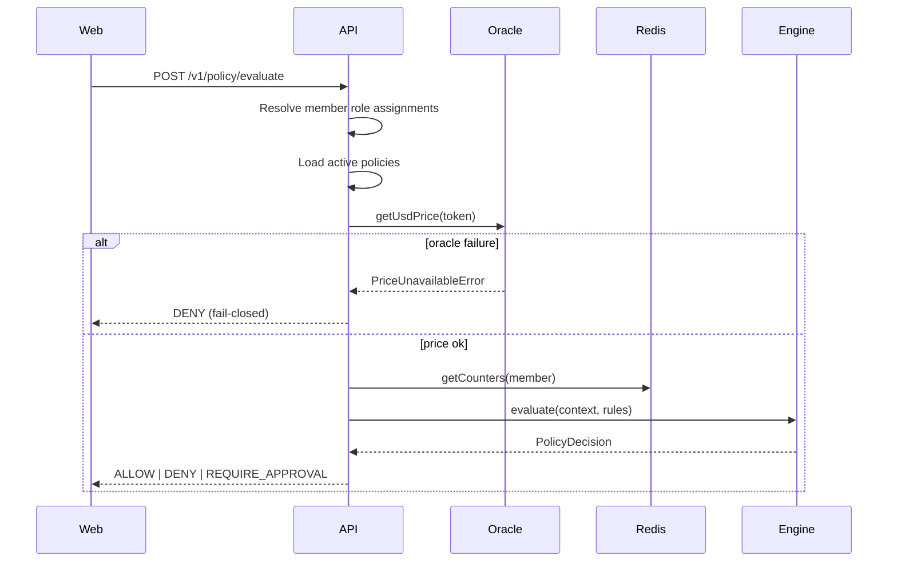

# Policy evaluation flow

## Merge strategy

The `@wtp/policy-engine` package evaluates each rule, then merges:

1. Any **DENY** → final **DENY**
2. Else any **REQUIRE_APPROVAL** → final **REQUIRE_APPROVAL** (highest `approverCount` wins)
3. Else **ALLOW**

## Dry-run vs intent

`POST /v1/policy/evaluate` is a dry-run preview. Persisted intents (Stage 4) reuse the same evaluation path before submission.
